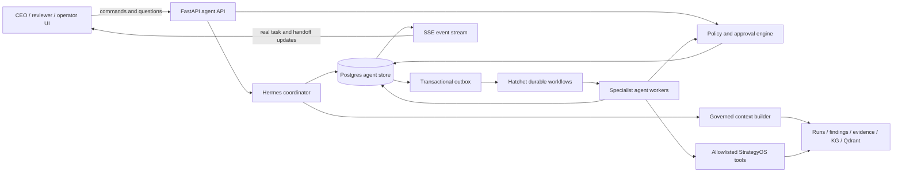
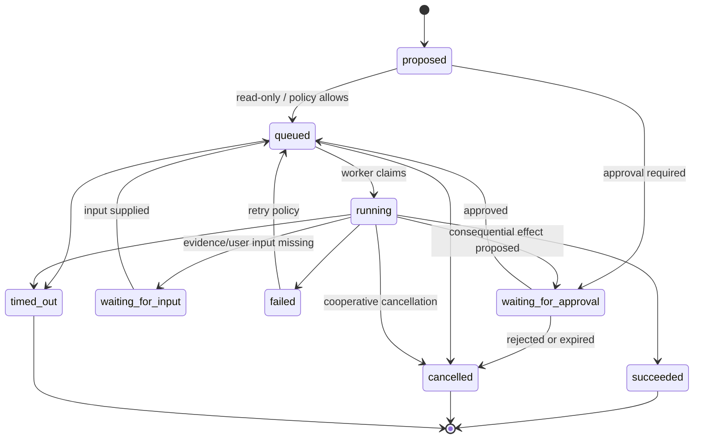

# StrategyOS agents layer — implementation-ready design

Date: 2026-07-12  
Status: Proposed target architecture  
Audience: product, engineering, security, QA, and implementation agents

## 1. Outcome

StrategyOS should add a durable, governed agents layer behind the CEO experience.

After this work:

- every visible agent/module card is backed by a real server-side agent definition;
- every unit of agent work is a durable task with an owner, lifecycle, attempts, evidence, and audit history;
- collaboration is represented by typed handoffs between agents, not synthetic chat copy;
- Hermes can explain, delegate, monitor, and summarize work without silently acquiring permission to execute it;
- conversations survive refreshes and sign-ins because messages are stored server-side;
- consequential actions pause at a server-enforced approval gate;
- the CEO app receives live status from real task, handoff, approval, and message records;
- every claim and action can be traced to the run, finding, evidence, tool call, model, and human decision that produced it.

This is a proper multi-agent application layer, but it deliberately does **not** require one permanently running operating-system process per agent. An agent is a versioned identity and policy executed by durable workers. Its continuity comes from persisted conversations, tasks, events, and memory.

## 2. Product definition

### Hermes

Hermes is the CEO-facing chief-of-staff agent. Hermes owns the executive conversation and coordinates specialists. It may:

- answer board and business questions from governed context;
- decide which specialist is best suited to investigate a question;
- create a proposed delegation plan;
- start read-only work within the user's authority;
- request approval before work that changes state or crosses a policy threshold;
- monitor delegated tasks and summarize their results;
- tell the user when evidence is missing or an answer cannot be supported.

Hermes must not:

- bypass reviewer, operator, publication, or system gates;
- invent a specialist result;
- present a proposed task as completed work;
- execute arbitrary tools supplied by model output;
- broaden a user's data or action permissions;
- treat another agent's natural-language response as trusted executable input.

### Specialist agents

The initial production catalogue should contain four specialists matching the existing module surface:

| Agent | Responsibility | Default tools | Consequential actions |
|---|---|---|---|
| Cash Recovery Agent | Find, quantify, and monitor recoverable leakage | findings, finance facts, citations, graph queries | create remediation proposal; never move money |
| Evidence Closure Agent | Resolve citation gaps, validate provenance, and challenge weak findings | evidence search, citation resolver, finding audit | request reviewer closure; cannot self-approve |
| Board Pack Agent | Produce board-safe summaries and publication candidates | governed packet, approved findings, report renderer | publication always requires the existing gate |
| Runtime Guardrail Agent | Inspect runtime, connector, queue, and policy health | health/config metadata, workflow status, audit events | operational changes require operator/admin approval |

Additional agents can be introduced later through the same registry. A new UI card is not considered an agent until it has a registered definition, policy, task handler, and observable execution path.

### Collaboration

Agent collaboration means:

1. an agent or user creates a typed task;
2. the owning agent may complete it or create a typed handoff;
3. the recipient accepts or rejects the handoff under policy;
4. the recipient performs work through allowlisted tools;
5. results are returned as a structured task result with evidence;
6. the requester incorporates or escalates the result;
7. all transitions are persisted as immutable events.

Natural-language messages may accompany a handoff for readability, but the structured handoff contract is authoritative.

## 3. Architectural principles

1. **Postgres is the source of truth.** Agent state, conversations, tasks, handoffs, approvals, attempts, tool calls, and events are durable database records.
2. **Hatchet runs durable work.** It schedules and retries tasks; it is not the business-state database.
3. **Redis is optional transport, never truth.** Use it for short-lived fan-out, rate limiting, or SSE acceleration only.
4. **HTTP commands plus SSE updates.** Mutations use authenticated HTTP endpoints. The UI receives one-way updates through Server-Sent Events with resumable event cursors.
5. **Tasks and conversations are separate.** A conversation explains intent and outcome; a task controls execution.
6. **Handoffs are typed.** Agent-to-agent work is a durable request with a schema, deadline, expected output, and policy decision.
7. **Tools are capabilities, not model-generated code.** Workers execute registered Python functions through validated input/output contracts.
8. **Authority never increases through delegation.** Effective permission is the intersection of the user, agent, tenant, tool, and task policy.
9. **Consequential work is propose-then-approve.** The system can prepare a change without applying it; the approval decision is server-enforced.
10. **Evidence is part of the result contract.** Business claims carry citations, confidence, gaps, and the run/as-of boundary.
11. **At-least-once execution, effectively-once effects.** Workers may retry; idempotency keys and unique effect records prevent duplicate side effects.
12. **The UI never fabricates live work.** Counts, statuses, exchanges, and timestamps come from the agents API.

## 4. Target architecture



### Existing components to retain

- `strategyos_mvp/assistants/orchestrator.py`: reuse persona-aware answer composition and deterministic/LLM routing behind Hermes.
- `strategyos_mvp/twins/protocol.py`: use as input to the new handoff domain model; replace file-backed delivery with Postgres repositories.
- `strategyos_mvp/twins/runtime.py`: reuse OODA and escalation concepts, but invoke them through task workers.
- `strategyos_mvp/twins/orchestration.py`: reuse governance-gate concepts and board-cycle logic.
- `strategyos_mvp/hatchet_runtime.py`: add agent-task workflow entry points beside the existing run and twin workflows.
- `strategyos_mvp/state_store.py`: follow its pooled Postgres repository pattern, but place the new persistence logic in a focused agents package.
- `strategyos_mvp/runtime_governance.py`: continue to own governed run/review state.
- existing prompt-injection, sensitive-id, citation, graph, and public-safe boundaries.

### New package boundary

Create `strategyos_mvp/agent_runtime/`:

```text
agent_runtime/
  __init__.py
  models.py              # enums and immutable domain contracts
  registry.py            # versioned agent and tool definitions
  repository.py          # Postgres persistence and transitions
  service.py             # application use cases
  coordinator.py         # Hermes planning/delegation logic
  policy.py              # authorization and approval decisions
  context.py             # scoped context snapshots
  tools.py               # tool registry and validated invocation
  workers.py             # specialist handlers
  workflows.py           # Hatchet task/timeout/escalation workflows
  events.py              # append-only events and outbox publishing
  streaming.py           # SSE projection
  projections.py         # CEO module/network read models
  errors.py              # public-safe domain errors
```

The API route layer should stay thin. Domain transitions belong in `service.py` and `repository.py`, not in `api.py` or the browser.

## 5. Core domain model

All records are tenant-scoped. IDs exposed as identifiers are UUIDs. Human-readable keys such as `cash-recovery` are never passed to UUID parameters.

### 5.1 Agent definition

A versioned, immutable execution contract:

```json
{
  "agent_key": "cash-recovery",
  "version": 1,
  "display_name": "Cash Recovery Agent",
  "purpose": "Quantify and monitor recoverable leakage",
  "handler_key": "cash_recovery.v1",
  "input_schema": "cash_recovery_task.v1",
  "output_schema": "agent_result.v1",
  "tool_keys": ["findings.read", "finance_facts.read", "citations.search"],
  "allowed_roles": ["executive", "finance", "reviewer", "operator"],
  "max_handoff_depth": 3,
  "default_timeout_seconds": 300,
  "enabled": true
}
```

Definitions are deployed with code and synchronized into the database. Editing a definition creates a new version; in-flight tasks retain the version they started with.

### 5.2 Conversation

A durable human/agent collaboration container. It has participants and messages, and may reference many tasks. A conversation is not itself an execution queue.

Scope fields:

- `tenant_id`
- `created_by_subject`
- `persona`
- optional `run_id`, `finding_id`, and board lifecycle
- visibility classification
- archived timestamp

### 5.3 Task

The authoritative unit of work:

```json
{
  "task_id": "uuid",
  "conversation_id": "uuid",
  "parent_task_id": null,
  "agent_installation_id": "uuid",
  "requested_by_type": "user",
  "requested_by_id": "subject-or-agent-installation-id",
  "task_type": "investigate_recoverable_value",
  "objective": "Reconcile the reported recoverable value",
  "input": {"run_id": "uuid"},
  "risk_class": "read_only",
  "status": "queued",
  "idempotency_key": "tenant:conversation:client-request-id",
  "deadline_at": "2026-07-12T13:00:00Z",
  "result": null
}
```

### 5.4 Handoff

A handoff delegates a bounded part of one task to another agent:

```json
{
  "handoff_id": "uuid",
  "source_task_id": "uuid",
  "child_task_id": "uuid",
  "from_agent_installation_id": "uuid",
  "to_agent_installation_id": "uuid",
  "reason": "Citation coverage is below policy",
  "requested_capability": "resolve_evidence_gap",
  "input": {"finding_ids": ["FIN-003"]},
  "expected_output_schema": "evidence_closure_result.v1",
  "status": "accepted",
  "deadline_at": "2026-07-12T12:15:00Z"
}
```

The target agent must be registered for the requested capability. Handoff depth, fan-out, cost, and time budgets are checked before acceptance.

### 5.5 Context snapshot

Every task receives an immutable context manifest instead of arbitrary access to the entire application state:

- tenant and principal scope;
- originating conversation, run, finding, board, and driver IDs;
- as-of timestamp;
- allowed evidence/document IDs;
- public-safe versus restricted classification;
- policy decision and effective capabilities;
- hashes/versions of important source records.

The manifest is persisted with the task attempt. Qdrant and Neo4j provide retrieval, but cited Postgres/evidence records remain the authority.

### 5.6 Agent result

All specialists return the same outer envelope:

```json
{
  "summary": "Three findings explain SAR 555K; five additional findings explain SAR 239K.",
  "status": "complete",
  "data": {},
  "citations": [
    {"kind": "finding", "id": "FIN-003", "locator": "recoverable_sar"}
  ],
  "confidence": "high",
  "gaps": [],
  "proposed_actions": [],
  "artifacts": [],
  "metrics": {"input_tokens": 0, "output_tokens": 0, "cost_usd": 0.0}
}
```

An unsupported result uses `status = "insufficient_evidence"` and names the gaps. It must not substitute generic boilerplate.

## 6. Persistence design

Add one forward-only migration. Do not overload `strategyos_agent_events`; it is currently a finding-audit table with run-specific columns. Preserve it for backward compatibility and create a normalized agents schema.

### Required tables

| Table | Purpose | Important constraints |
|---|---|---|
| `strategyos_agent_definitions` | Versioned shipped agent contracts | unique `(agent_key, version)` |
| `strategyos_agent_installations` | Tenant-enabled agent configuration | unique active `(tenant_id, agent_key)` |
| `strategyos_agent_conversations` | Durable executive/agent threads | tenant, creator, scope, classification |
| `strategyos_agent_participants` | Users and agents in a conversation | unique participant per conversation |
| `strategyos_agent_messages` | Immutable user, agent, system, and tool-visible messages | monotonic sequence per conversation |
| `strategyos_agent_tasks` | Durable unit of execution | unique tenant idempotency key; constrained status |
| `strategyos_agent_task_attempts` | Retries and model/worker execution metadata | unique `(task_id, attempt_no)` |
| `strategyos_agent_handoffs` | Typed delegation and return lifecycle | child task required; no self-handoff |
| `strategyos_agent_approval_requests` | Approval required for an intended effect | links existing approval when applicable |
| `strategyos_agent_tool_invocations` | Validated tool request/result and effect key | unique effect/idempotency key |
| `strategyos_agent_artifact_links` | Task/message links to evidence and artifacts | reference type + reference id |
| `strategyos_agent_events_v2` | Immutable domain-event log | unique aggregate version |
| `strategyos_agent_outbox` | Transactional delivery to Hatchet/SSE fan-out | event id unique, publish attempts |

### Essential task columns

```sql
id uuid primary key default gen_random_uuid(),
tenant_id uuid not null references strategyos_tenants(id),
conversation_id uuid references strategyos_agent_conversations(id),
parent_task_id uuid references strategyos_agent_tasks(id),
agent_installation_id uuid not null references strategyos_agent_installations(id),
agent_definition_version integer not null,
task_type text not null,
objective text not null,
input_json jsonb not null default '{}'::jsonb,
context_manifest_json jsonb not null default '{}'::jsonb,
risk_class text not null check (risk_class in ('read_only','prepare','write','restricted')),
status text not null check (status in (
  'proposed','waiting_for_approval','queued','running','waiting_for_input',
  'succeeded','failed','cancelled','timed_out'
)),
requested_by_type text not null check (requested_by_type in ('user','agent','system')),
requested_by_id text not null,
idempotency_key text not null,
deadline_at timestamptz,
result_json jsonb,
failure_code text,
failure_detail_public text,
created_at timestamptz not null default now(),
updated_at timestamptz not null default now(),
started_at timestamptz,
finished_at timestamptz,
unique (tenant_id, idempotency_key)
```

Internal exception text belongs in restricted logs/attempt metadata. `failure_detail_public` must contain an allowlisted, user-safe explanation.

### Event envelope

Every transition writes an event in the same transaction:

```json
{
  "event_id": "uuid",
  "tenant_id": "uuid",
  "aggregate_type": "agent_task",
  "aggregate_id": "uuid",
  "aggregate_version": 4,
  "event_type": "agent.task.waiting_for_approval.v1",
  "occurred_at": "2026-07-12T12:00:00Z",
  "actor": {"type": "agent", "id": "uuid"},
  "correlation_id": "uuid",
  "causation_id": "uuid",
  "trace_id": "trace-id",
  "payload": {"approval_request_id": "uuid", "risk_class": "write"},
  "public_projection": {"status": "waiting_for_approval", "label": "Approval needed"}
}
```

Use an optimistic aggregate version to reject conflicting state transitions. The outbox row is inserted in the same transaction as the event and business record update.

## 7. Lifecycles

### Task lifecycle



Only the service/repository transition method may change a status. Direct status updates from API handlers or workers are prohibited.

### Handoff lifecycle

`proposed → accepted → in_progress → completed`

Alternative terminal paths:

- `proposed → rejected`
- `proposed|accepted|in_progress → escalated`
- `proposed|accepted → expired`

Completing a handoff requires the child task to be terminal and its result to validate against the requested output schema.

### Approval lifecycle

`pending → approved | rejected | expired | cancelled`

Approvals bind to an immutable proposed effect hash. If inputs, target, amount, tool, or policy-relevant context changes, the approval is invalid and a new request is required.

## 8. Execution flow

### 8.1 CEO asks an informational question

1. UI posts a message to the conversation.
2. API authenticates the principal and stores the user message.
3. Hermes classifies the intent as `answer`.
4. Context builder creates a scoped snapshot of the latest governed data.
5. Existing assistant orchestration produces a deterministic or evidence-grounded answer.
6. The answer, citations, basis, model metadata, and trace are persisted.
7. SSE emits `agent.message.created.v1`.

This path can remain synchronous within a bounded timeout. It does not create background work unless the answer requires investigation.

### 8.2 CEO asks for an investigation

1. Hermes classifies the intent as `delegate` and selects a capability, not a hard-coded display label.
2. Policy resolves the eligible agent and effective scope.
3. Service creates a `proposed` task and an explanatory Hermes message in one transaction.
4. Read-only work automatically transitions to `queued`; higher-risk work creates an approval request.
5. The outbox dispatcher starts the Hatchet workflow using `task_id` as the idempotency anchor.
6. A worker locks the task, creates an attempt, and executes the registered handler.
7. Tool calls are validated, recorded, and executed under the task capability token.
8. The worker stores a structured result and transitions the task.
9. Hermes receives the result event and writes an executive summary message.
10. UI module and collaboration projections update through SSE.

### 8.3 Specialist requests help

1. Worker emits a typed handoff proposal with requested capability and expected schema.
2. Policy rejects loops, excess depth/fan-out, missing permissions, or exhausted budgets.
3. Service creates the handoff and child task atomically.
4. Child task follows the standard approval/queue lifecycle.
5. On completion, the parent workflow resumes with the validated child result.
6. If the deadline expires, escalation follows the registered policy; it does not default to an all-powerful agent.

### 8.4 Consequential action

1. Agent prepares a proposed action and exact effect payload.
2. Policy assigns risk class and approval route.
3. System stores an approval request containing the effect hash and user-safe explanation.
4. Reviewer/operator uses the existing authenticated approval surface.
5. Approval writes the human identity, role, comment, timestamp, and effect hash.
6. Worker revalidates authorization and context immediately before applying the effect.
7. Tool invocation records the idempotency/effect key before the external call.
8. Result is audited and surfaced to the requester.

No model response can directly mark an approval as granted.

## 9. Hermes coordination contract

Hermes produces a validated decision object before answering or delegating:

```json
{
  "intent": "answer | delegate | clarify | refuse",
  "executive_summary": "string",
  "capability": "resolve_evidence_gap",
  "task_type": "evidence_closure",
  "objective": "Resolve citation gaps for challenged findings",
  "scope": {"run_id": "uuid", "finding_ids": ["FIN-003"]},
  "risk_class_hint": "read_only",
  "success_criteria": ["All claims have resolvable citations"],
  "missing_inputs": [],
  "user_confirmation_required": false
}
```

The policy engine, not Hermes, decides the final risk class and whether approval is required. Invalid or unknown capabilities result in `clarify` or `refuse`, never an invented route.

For the first release, agent selection should be deterministic:

| Capability | Agent |
|---|---|
| `quantify_recoverable_value` | Cash Recovery Agent |
| `monitor_recovery_case` | Cash Recovery Agent |
| `resolve_evidence_gap` | Evidence Closure Agent |
| `challenge_finding` | Evidence Closure Agent |
| `prepare_board_pack` | Board Pack Agent |
| `explain_publication_posture` | Board Pack Agent |
| `inspect_runtime_health` | Runtime Guardrail Agent |
| `diagnose_connector_or_queue` | Runtime Guardrail Agent |

An LLM may classify intent into this allowlist, but it may not invent agents, tools, or capabilities.

## 10. Tool layer

Each tool definition contains:

- stable tool key and version;
- input and output JSON schema;
- allowed agent keys and principal roles;
- risk class;
- timeout and retry policy;
- side-effect and idempotency behavior;
- data classification and redaction policy;
- Python handler import path.

Initial tools should wrap existing functions rather than duplicate logic:

| Tool key | Existing seam | Risk |
|---|---|---|
| `findings.read` | latest run/finding repositories | read-only |
| `citations.search` | `state_store.search_citations_for_run` and citation resolver | read-only |
| `graph.query` | `graph_queries.py` / assistants graph retrieval | read-only |
| `finance_controls.run` | `skills/finance_controls.py` | prepare |
| `board_pack.prepare` | governed publication/board packet logic | prepare |
| `review.request` | current reviewer queue | prepare |
| `publication.release` | existing reviewer/operator publication path | restricted |
| `runtime.health.read` | health/config projections, with secrets removed | read-only |

Tool handlers receive a `ToolExecutionContext` constructed by the server. They do not receive raw bearer tokens, database URLs, or unrestricted repositories.

## 11. API design

Use authenticated, tenant-scoped endpoints under `/api/v1`. Return RFC 9457-style public-safe problem responses with a stable `code`, never raw database or model exceptions.

### Catalogue and projections

- `GET /api/v1/agents` — permitted installed agents and capabilities.
- `GET /api/v1/agents/{agent_id}` — definition, health, and bounded metrics.
- `GET /api/v1/agent-network` — running tasks, handoffs, approvals, and summary counts for the UI.

### Conversations

- `POST /api/v1/agent-conversations`
- `GET /api/v1/agent-conversations/{conversation_id}`
- `GET /api/v1/agent-conversations/{conversation_id}/messages?after_sequence=`
- `POST /api/v1/agent-conversations/{conversation_id}/messages`
- `POST /api/v1/agent-conversations/{conversation_id}/archive`

Message creation requires `Idempotency-Key`. The response includes persisted user message, Hermes status, and any created task IDs.

### Tasks and handoffs

- `POST /api/v1/agent-tasks`
- `GET /api/v1/agent-tasks/{task_id}`
- `POST /api/v1/agent-tasks/{task_id}/cancel`
- `POST /api/v1/agent-tasks/{task_id}/input`
- `GET /api/v1/agent-tasks/{task_id}/events?after=`
- `POST /api/v1/agent-tasks/{task_id}/handoffs` — internal or privileged route.

### Approvals

- `GET /api/v1/agent-approvals?status=pending`
- `POST /api/v1/agent-approvals/{approval_id}/decision`

Where an agent action maps to an existing run/reviewer approval, the service should link to `strategyos_approvals` and use the existing role/claim rules rather than create a second source of approval truth.

### Live events

- `GET /api/v1/agent-events/stream?conversation_id=&task_id=`

SSE requirements:

- support `Last-Event-ID`;
- authorize every subscription scope;
- emit heartbeat comments;
- fetch missed events from Postgres before switching to live fan-out;
- use bounded public projections, not raw event payloads;
- fall back to polling `GET /api/v1/agent-network?after=` when streaming is unavailable.

## 12. CEO UI behavior

### Governed Assistant Network

Replace `agent_modules.running` as the runtime authority with `GET /api/v1/agent-network`.

Each card displays:

- agent name and capability;
- actual task status;
- current objective in executive language;
- last meaningful update time;
- approval/input dependency;
- latest verified output metric;
- a real detail route.

Clicking a card opens a detail panel containing the task timeline, evidence, handoffs, approvals, and result. It must not create a new chat unless the user explicitly chooses “Ask Hermes about this.”

### Hermes ↔ assistants panel

Render real handoffs grouped by parent task. Each line comes from persisted message/event data. Use precise labels:

- `Working` only for a running task;
- `Waiting for reviewer` only for a pending approval;
- `Needs input` only for `waiting_for_input`;
- `Complete` only for a succeeded task with validated result;
- `Could not complete` for terminal failure with user-safe reason.

Remove copy such as “following up automatically” unless a follow-up task actually exists.

### Chat

The browser no longer owns canonical thread history. Session storage may cache the latest messages for fast rendering, but the server conversation is authoritative.

When Hermes delegates, show a visible task card in the conversation:

```text
Evidence Closure Agent
Resolving citations for 3 challenged findings
Status: Waiting for reviewer
[View work] [Cancel]
```

The CEO should see an executive summary by default and drill into technical traces only where their role permits it.

## 13. Security and governance

### Authorization

- authenticate every non-public agents endpoint;
- resolve `tenant_id` from the authenticated principal, never request input;
- check role and resource scope on every command and stream;
- treat agent identity separately from human identity;
- record both the initiating human and executing agent on every effect;
- never permit an agent to call a tool solely because its prompt says it can.

### Capability token

Workers receive a short-lived, server-signed task capability containing:

- tenant, task, attempt, and agent IDs;
- allowed tool keys;
- data scope/reference IDs;
- maximum risk class;
- expiry and nonce.

Tool dispatch verifies it. The token is not forwarded to an LLM or written into prompts.

### Prompt injection and untrusted content

- pass retrieved documents as labelled untrusted evidence;
- preserve the existing prompt-injection scanner;
- prevent evidence text from changing tool or policy instructions;
- require structured model output and schema validation;
- redact secrets and internal infrastructure details from prompts and messages;
- cap retrieved documents and context size;
- store the prompt template version and evidence manifest, not secret runtime configuration.

### Budgets and loop prevention

Per root task, enforce:

- maximum handoff depth: 3;
- maximum child tasks: 8;
- maximum attempts per task: 3;
- maximum wall-clock duration;
- token and cost budget;
- maximum tool invocations;
- no handoff to the same agent for the same capability and scope hash;
- circuit breaker after repeated equivalent failures.

### Data retention

- conversation/message retention follows tenant policy;
- audit events and approvals follow compliance policy and are append-only;
- task context stores references/hashes where possible, not duplicate sensitive documents;
- deletion/archival is tenant-scoped and audited;
- public-safe projections never expose raw prompts, SQL, stack traces, private paths, or model-provider details.

## 14. Reliability and recovery

### Delivery semantics

1. API writes task + event + outbox atomically.
2. Dispatcher publishes the task ID to Hatchet.
3. Worker claims via an atomic compare-and-set transition.
4. A retry creates a new attempt, not a duplicate task.
5. External-effect tools reserve a unique effect key before execution.
6. Completion commits result + event atomically.

### Stuck work

A scheduled reconciler should:

- re-publish unpublished outbox events;
- detect queued tasks with no workflow ID;
- detect running tasks with expired leases/heartbeats;
- mark deadlines as timed out;
- expire approvals;
- trigger policy-defined escalations;
- compare Hatchet status with Postgres and record reconciliation events.

### Failure taxonomy

Use stable internal codes:

- `AGENT_INVALID_INPUT`
- `AGENT_NOT_PERMITTED`
- `AGENT_APPROVAL_REQUIRED`
- `AGENT_EVIDENCE_INSUFFICIENT`
- `AGENT_TOOL_UNAVAILABLE`
- `AGENT_MODEL_UNAVAILABLE`
- `AGENT_TIMEOUT`
- `AGENT_BUDGET_EXCEEDED`
- `AGENT_CONFLICT`
- `AGENT_INTERNAL_FAILURE`

The CEO receives a useful action-oriented message. Internal traces are correlated by `trace_id` and restricted to operator/system logs.

## 15. Observability

Record OpenTelemetry-compatible spans across API → Hermes → policy → outbox → Hatchet → worker → tool.

Minimum metrics:

- task count and duration by agent/type/status;
- queue wait and attempt count;
- success, insufficient-evidence, cancellation, timeout, and failure rates;
- approval wait time and decision rate;
- handoff depth/fan-out and escalation count;
- model tokens, cost, latency, and fallback rate;
- tool latency/error/idempotent replay rate;
- SSE connections, replay lag, and delivery lag;
- unsupported-answer rate and citation coverage.

Minimum audit fields:

- tenant, principal subject/role, agent definition/version;
- conversation/task/attempt/handoff/approval IDs;
- correlation, causation, trace, and idempotency IDs;
- context manifest hash;
- prompt and policy versions;
- model provider/model where an LLM was used;
- tool key/version, validated input hash, output hash;
- evidence/citation references;
- status transition and public-safe explanation.

## 16. Migration from the current app

The migration should preserve the existing CEO surface and introduce real state behind it in vertical slices.

### PR 1 — Domain contracts and Postgres foundation

Add:

- `agent_runtime/models.py`, `registry.py`, `repository.py`, and `events.py`;
- forward-only schema migration and indexes;
- four versioned agent definitions;
- task, handoff, event, and approval transition tests;
- idempotency and tenant-isolation tests.

No UI behavior changes.

### PR 2 — Durable task execution

Add:

- `agent_runtime/workflows.py`, `workers.py`, and `tools.py`;
- Hatchet `strategyos.agent.task.execute` workflow;
- outbox dispatcher and reconciliation job;
- read-only Cash Recovery and Evidence Closure handlers;
- attempt, retry, timeout, and effect-idempotency tests.

Keep current module payload as a fallback projection.

### PR 3 — Hermes durable conversations

Add:

- conversation/message repositories and `/api/v1/agent-conversations` endpoints;
- `coordinator.py` using the existing `AssistantOrchestrator`;
- persisted answer traces and citations;
- migration from client-only thread state to server history;
- explicit `answer`, `delegate`, `clarify`, and `refuse` outcomes.

Feature flag: `STRATEGYOS_AGENT_CONVERSATIONS_ENABLED`.

### PR 4 — Real specialist handoffs

Add:

- deterministic capability router;
- typed handoff creation/acceptance/completion;
- Board Pack and Runtime Guardrail handlers;
- approval binding and escalation deadlines;
- fan-out/depth/budget enforcement.

Feature flag: `STRATEGYOS_AGENT_HANDOFFS_ENABLED`.

### PR 5 — Live CEO network

Add:

- `/api/v1/agent-network` read model and SSE stream;
- real module detail panels;
- task cards in Hermes chat;
- real Hermes ↔ assistants timeline;
- reconnect/replay/polling behavior;
- remove derived handoff text once the feature flag is enabled.

Feature flag: `STRATEGYOS_AGENT_LIVE_UI_ENABLED`.

### PR 6 — Consequential actions and hardening

Add:

- capability tokens;
- prepare/approve/apply flows;
- security, redaction, retention, load, chaos, and recovery tests;
- operational dashboards and alerts;
- production runbook and rollback procedure.

Only after these gates pass should `a2a.mode` change from `derived_handoff_only` to `durable_task_handoffs`.

## 17. Detailed code-change map

| Existing file | Change |
|---|---|
| `strategyos_mvp/api.py` | register thin v1 routers; stop building synthetic collaboration after cutover |
| `strategyos_mvp/assistants/orchestrator.py` | expose structured Hermes decision/result APIs; retain persona formatting |
| `strategyos_mvp/hatchet_runtime.py` | register task execution, outbox reconciliation, timeout/escalation workflows |
| `strategyos_mvp/twins/protocol.py` | adapt message concepts to UUID-backed handoff contracts; keep compatibility adapters |
| `strategyos_mvp/twins/runtime.py` | invoke via worker context; replace file inbox as production authority |
| `strategyos_mvp/twins/store.py` | keep for compatibility/tests, then retire production JSON repositories |
| `strategyos_mvp/static/executive.js` | server conversations, network projection, task detail, SSE client |
| `strategyos_mvp/static/executive.html` | accessible task/handoff/detail containers |
| `strategyos_mvp/static/executive.css` | task states, timelines, approval and error treatments |
| `deploy/postgres/schema.sql` | new normalized agents tables and indexes |
| `deploy/docker-compose*.yml` | flags, dispatcher/worker settings, health checks |

Do not delete the existing twin code during the first implementation. Add adapters and remove file-backed production paths only after the Postgres path has parity and rollback coverage.

## 18. Test strategy

### Unit

- every allowed and forbidden task transition;
- capability routing and unknown capability rejection;
- policy intersection across user, agent, tool, tenant, and risk;
- handoff loop/depth/fan-out/budget checks;
- result and structured-output schema validation;
- effect hash and approval invalidation;
- public-safe error mapping.

### Repository/integration

- tenant isolation for every query;
- optimistic concurrency and duplicate command handling;
- transactional event/outbox writes;
- idempotent worker retries;
- Hatchet submission/reconciliation;
- approval race and cancellation race;
- SSE authorization, cursor replay, disconnect, and fallback polling.

### End-to-end

1. CEO asks why recoverable value does not reconcile.
2. Hermes creates a real Cash Recovery task.
3. Cash Recovery hands citation validation to Evidence Closure.
4. Both tasks appear in the network with real statuses.
5. Evidence result returns with citations.
6. Hermes summarizes the reconciled total.
7. Refresh preserves the conversation and task timeline.
8. Audit view shows user, Hermes, specialist, model/tool, evidence, and state transitions.

Additional E2E cases:

- insufficient evidence returns an honest gap;
- approval-required board publication cannot proceed before reviewer approval;
- rejected approval cancels the proposed effect;
- worker crash resumes without duplicate action;
- unauthorized CEO cannot open restricted Runtime Guardrail details;
- raw database/model errors never appear in the UI;
- expired handoff escalates exactly once;
- SSE reconnect replays missed updates without duplicates.

## 19. Acceptance criteria

The agents layer is production-ready when all of the following are true:

- [ ] Each of the four CEO module cards resolves to a registered, tenant-enabled agent.
- [ ] Every visible active status is backed by a non-terminal task or approval record.
- [ ] Every handoff shown in the UI is a persisted handoff with source and child task IDs.
- [ ] Hermes conversations persist server-side and survive browser refresh/sign-in.
- [ ] Informational answers and execution tasks are visibly distinct.
- [ ] All specialist results validate against a shared result envelope.
- [ ] Business claims include evidence or explicitly report insufficient evidence.
- [ ] No agent can exceed the initiating user's authority.
- [ ] Consequential tools require a valid, unexpired approval bound to the exact effect.
- [ ] Retried work cannot duplicate a side effect.
- [ ] All commands are idempotent and all state transitions are audited.
- [ ] Task/handoff status reaches the UI through authenticated SSE or polling fallback.
- [ ] Tenant isolation, redaction, prompt-injection, and raw-error tests pass.
- [ ] Hatchet/Postgres reconciliation and stuck-task recovery are operational.
- [ ] Feature flags allow immediate fallback to the current read-only module surface.
- [ ] `a2a.mode` reports `durable_task_handoffs` only when real persistence/execution is enabled.

## 20. Explicit non-goals for the first release

- agents transferring funds, editing ERP records, or emailing third parties;
- agents dynamically installing arbitrary tools or Python packages;
- user-created agent code executed in production;
- unconstrained group chat among models;
- semantic/vector memory treated as authoritative business data;
- one permanent process per agent identity;
- replacing existing reviewer/operator controls;
- exposing chain-of-thought or private model reasoning.

## 21. Recommended first vertical slice

Implement one traceable CEO flow before building the entire catalogue:

> “Why does SAR 794K not reconcile with the three visible findings?”

Expected real flow:

1. Hermes persists the question.
2. Hermes delegates `quantify_recoverable_value` to Cash Recovery.
3. Cash Recovery reads all governed findings for the selected run.
4. If citation coverage is weak, it hands off `resolve_evidence_gap` to Evidence Closure.
5. Both task timelines stream to the UI.
6. Results identify the visible subtotal, remaining findings, exact gap, and evidence.
7. Hermes returns a concise CEO explanation.
8. The full audit trace remains available to permitted users.

This slice exercises conversations, task execution, handoffs, evidence, UI projection, live updates, idempotency, and auditability while remaining read-only. It is the safest and most representative proof that the new agents layer is real.
