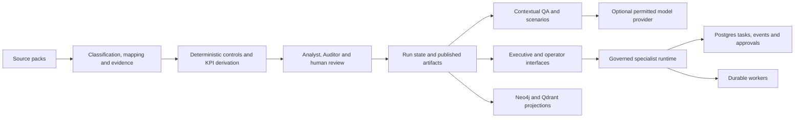

# StrategyOS architecture

Canonical implementation description · baseline `c03e958` with the consolidation changes recorded in Git.

## Current system

The application is a Python/FastAPI service with static executive and operator interfaces. It stages finance source packs, derives deterministic findings and KPIs, supports review and publication workflows, and exposes contextual question answering and a specialist agent runtime. The full System of Intent remains the target in [requirements.md](requirements.md); [the gap assessment](assessment/gap-analysis.md) limits readiness claims.

## Boundaries and code ownership

| Area | Implementation | Contract and current limits |
|---|---|---|
| Configuration | `strategyos_mvp/config.py`, `paths.py` | Explicit deployment environment overrides; local demo source root in `data/demo`. Credentials stay outside Git. |
| Source intake | `source_pack.py`, `source_governance.py`, `data_roles.py`, `ingestion.py`, `ocr.py` | Classifies evidence/control/restricted/history; maps fields and records quality/readiness. Manual snapshot intake is implemented; incremental client connectors remain open. |
| Evidence and finance | `evidence.py`, `citation_resolver.py`, `skills/finance_controls.py`, `source_finance_kpis.py` | Deterministic quantities and citations; source-specific assumptions and cross-client resolution need further proof. |
| Strategy enrichment | `source_strategy_enrichment.py`, `source_calendar.py`, `source_signals.py` | Reads enriched registers and composes executive context. This is not a generic strategy-to-KPI compiler. |
| Workflow/publication | `workflow.py`, `reviewer_runtime.py`, `run_executor.py`, `state_store.py`, `run_registry.py` | Review/resume and run state; Postgres/LangGraph and local paths differ. A pending run is not a completed publication. |
| Executive API/UI | `api.py`, `executive_read_model.py`, `executive_presentation.py`, `static/executive.*` | Derived run-based view and contextual Ask. Session/demo interactions coexist with persisted state. |
| QA and simulation | `qa.py`, `llm_qa.py`, `executive_synthesis.py`, `scenario_parser.py`, `assistants/` | Deterministic lookup/formulas plus optional provider narrative. Numeric claim validation still has a confirmed gap. |
| Authority/identity | `auth.py`, `idp.py`, `authority_matrix.py`, `runtime_governance.py` | Authentication, policy matrix and capability checks exist; coverage across tenant/BU/data surfaces is incomplete. Matrix publication is not an isolation attestation. |
| Specialist runtime | `agent_runtime/` | Versioned registry, context, policies, capability tokens, tasks, events, typed handoffs, projections, workers and streaming. Cash Recovery, Evidence Closure, Board Pack and Runtime Guardrail workers do not imply that every proposed domain agent is running. |
| Twins | `twins/` | Separate persona/state/orchestration surfaces and persistence. Unification with browser conversations and specialist tasks remains open. |
| Retrieval/storage | `neo4j_store.py`, `knowledge_graph.py`, `graph_queries.py`, `vector_store.py`, `storage.py` | Graph and vector/object projections; relational run state remains authoritative. Hash-vector fallback is not semantic embedding quality. |
| Operations | `deploy/`, `.github/workflows/` | Compose deployment, boundary checks, health, image build and rollback helpers; data restore, SLO and full tier acceptance require fresh proof. |

## Runtime invariants

Human approval must remain separate from model recommendation and worker execution. Structured task/handoff/effect records are authoritative; natural-language messages cannot expand authority or become executable tool definitions. Capability decisions intersect user, tenant, agent, task and tool scope. Retry paths use idempotency/unique effects rather than promising exactly-once delivery.

Postgres is the durable production business-state store; Hatchet schedules work, and Redis provides coordination/transport. Local JSON fallbacks are development behavior. Neo4j and Qdrant are rebuildable projections, not alternate authoritative approvals. Imported evaluator/control material must remain outside business evidence retrieval. A closed board packet requires immutable content/context; the current implementation has not yet proven that full invariant.

## Canonical repository and data

`main` is the active application line. The consolidation fast-forwarded local main by 121 commits to the reviewed implementation before applying cleanup. Old merged local branches are removed; divergent history is retained in a recovery Git bundle outside the workspace. A separate Agent Studio worktree used by another project remains outside this application's release baseline.

`data/demo/01_Synthetic_Dataset` is the current enriched Mizan demo, and `data/demo/04_Strategic_Context` contains strategy/market inputs. `tests/fixtures/01_Synthetic_Dataset` is the smaller legacy finance regression fixture; `tests/fixtures/poc2` is a deliberately fixed intake-accounting fixture. These are distinct test contracts, not competing application versions. See [data/README.md](../data/README.md). Runtime `outputs/source_packs` and `.strategyos_mvp_data` are local state and are not deleted as duplicate source code.

## Extension rules

Add domain logic behind existing seams rather than increasing `api.py` responsibilities. New agents require a definition, policy, tool/input/output contract, durable execution and observable result. A new retrieval engine requires ACL filters, citation opening and migration/rebuild tests. New invoice normalization must be additive until control/evidence parity is proven. Every implemented requirement change updates tests, [requirements](requirements.md) and the current gap record together.
